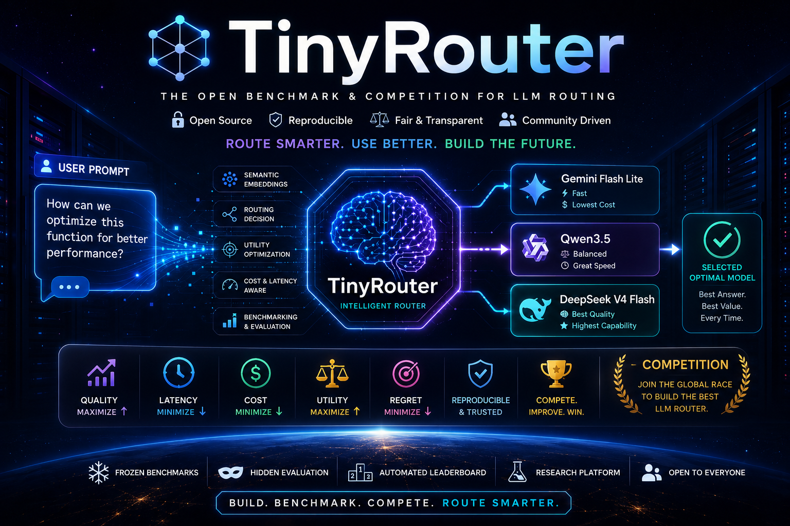

# TinyRouter

Multi-benchmark routing competition for SN74 on Gittensor.

[](https://james-cuda.github.io/Gittensor-TinyRouter/)
[](https://github.com/entrius/gittensor)
[](LICENSE)

TinyRouter is a learned orchestration benchmark and miner competition built around a simple question:

**Can a small coordinator route better than any fixed model across software engineering, coding, and reasoning tasks?**

Built for SN74 on Gittensor. Contributors submit PRs that improve the live routing frontier. The evaluation loop verifies correctness on frozen benchmark slices, scores the verified marginal gain, and rewards merged improvements.

**Quick links:** [Website](https://james-cuda.github.io/Gittensor-TinyRouter/) ·
[Leaderboard](leaderboard.json) · [Submission Guide](SUBMITTING.md) ·
[Contributing](CONTRIBUTING.md) · [Roadmap](ROADMAP.md) · [Glossary](docs/GLOSSARY.md)

## Current Competition

The current tracked benchmark suite is:

- SWE-bench Verified
- LiveCodeBench v6
- MMLU-Pro

The current model pool is:

- Qwen3.5-35B-A3B
- MiniMax M3
- DeepSeek V4 Flash

The competition target is a **single shared head** that routes across all three benchmarks under one frozen protocol.

## What TinyRouter Is

TinyRouter is a lightweight multi-turn coordinator inspired by TRINITY.

For each task, the coordinator chooses:

- which model to call
- which role it should play

Roles:

- Thinker
- Worker
- Verifier

The coordinator itself is intentionally small. It does not solve the task directly. It only learns delegation.

The long-term system has two stages:

1. **TRINITY stage**  
   A frozen encoder plus a small routing head trained with separable CMA-ES.

2. **Conductor stage**  
   A larger orchestration policy that generates workflows, subtasks, and context-sharing structure.

## Why SN74

SN74 rewards real, reproducible improvements on shipped open-source code and evaluation infrastructure.

TinyRouter follows the same spirit:

- source-required improvements
- frozen benchmark protocol
- deterministic evaluation rules
- hidden eval and audit sets
- manual merge after review
- rewards tied to verified marginal gain, not claims in a PR description

## How The Competition Works

The loop is intentionally tight:

1. Pick a narrow improvement target in routing, evaluation, or orchestration.
2. Submit a PR with source changes.
3. The evaluator runs the PR against the frozen benchmark protocol.
4. The system verifies correctness first.
5. If the PR improves the live frontier, it gets a score label.
6. Maintainers merge the best verified frontier improvements.

This keeps rewards tied to measurable benchmark gains on the live codebase.

## Benchmark Protocol

TinyRouter uses a **frozen composite benchmark**, not raw public leaderboard scoring.

For each benchmark we freeze:

- dataset revision / commit
- exact sampled task IDs
- harness version
- decode settings
- scoring rules
- random seed

### Current Evaluation Shape

Per benchmark:

- hidden eval set: `n = 100–120`
- optional hidden audit set: separate from eval

Benchmarks are weighted equally in the final composite score.

### Current Benchmarks

- `SWE-bench Verified`  
  repository-grounded patch generation and validation
- `LiveCodeBench v6`  
  code generation under a fixed evaluation harness
- `MMLU-Pro`  
  multiple-choice reasoning and knowledge

This is a router benchmark built on top of these tasks. It is not a direct replacement for each benchmark's official public leaderboard.

## Scoring

Scoring is **verified benchmark improvement only**.

A PR can improve:

- average composite score
- one benchmark score, if the composite frontier improves
- later, cost-adjusted or latency-adjusted routing efficiency

Non-frontier changes are welcome but score `0` unless they produce a verified improvement under the frozen evaluator.

### Proposed Labels

- `eval:XL`
- `eval:L`
- `eval:M`
- `eval:S`
- `eval:XS`
- `eval:none`
- `eval:REJECT`
- `eval:BASELINE`

Suggested meaning:

- `BASELINE`  
  first verified frontier entry
- `XS` to `XL`  
  verified gain over the live frontier
- `none`  
  correct, but no meaningful improvement
- `REJECT`  
  failed correctness, violated protocol, or regressed the frontier

Exact score thresholds should live in the evaluator config, not the README.

## Current Training Path

### Stage 1: TRINITY Head

Train a shared routing head across all three benchmarks.

Planned hardware:

- RTX 5090

Method:

- frozen encoder
- lightweight head
- multi-turn routing
- Thinker / Worker / Verifier roles
- separable CMA-ES

### Stage 2: Conductor

Train a workflow-generating orchestrator after the routing baseline is stable.

Planned hardware:

- H100

Method:

- learned subtask decomposition
- worker assignment
- context / access graph
- verification and refinement
- recursive orchestration later if justified

## Miner Guide

If you are contributing for SN74-style rewards, your PR should target one of these categories:

- routing quality
- benchmark adapter correctness
- evaluation harness reliability
- cost / latency measurement
- conductor workflow quality
- reproducibility and anti-cheat hardening

A valid submission should include:

- source changes only
- reproducible config
- exact claimed benchmark target
- no hidden protocol changes
- no dataset substitution
- no benchmark-specific cheating
- no prompt hardcoding to sampled hidden IDs

Recommended submission artifacts:

- routing head artifact
- config receipt
- cost ledger
- commit hash
- run summary

## Evaluation Rules

The evaluator should check:

- correct artifact format
- correct parameter shape
- allowed model pool only
- frozen dataset manifest
- frozen harness version
- no protocol drift
- benchmark correctness before scoring
- hidden eval score
- hidden audit score

The evaluator does not auto-merge. Merge remains manual after review.

## Layout

```text
configs/       benchmark, model-pool, and evaluator configs
benchmarks/    dataset adapters and harness glue
src/           coordinator, conductor, training, eval
scripts/       training, evaluation, packaging, leaderboard tools
docs/          protocol, roadmap, results, scoring rules
tests/         offline and harness tests
experiments/   local run outputs
```
